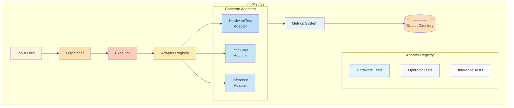

# Project Architecture

This document describes the architecture and organization of the InfiniMetrics framework.

## Directory Structure

```
InfiniMetrics/
├── main.py                         # Main entry point
├── infinimetrics/
│   ├── adapter.py                  # Base adapter interface
│   ├── dispatcher.py               # Test orchestration
│   ├── executor.py                 # Universal test executor
│   ├── input.py                    # Test input data classes
│   │
│   ├── common/                     # Shared utilities
│   │   ├── constants.py            # Test types, metrics, enums
│   │   ├── metrics.py              # Metric definitions
│   │   └── testcase_utils.py       # Test case utilities
│   │
│   ├── hardware/                   # Hardware testing modules
│   │   └── cuda-memory-benchmark/  # CUDA memory benchmark suite
│   │       ├── include/            # C++ headers
│   │       ├── src/                # CUDA/C++ sources
│   │       ├── CMakeLists.txt      # Build configuration
│   │       ├── build.sh            # Build script
│   │       └── QUICKSTART.md       # Hardware test quick start guide
│   │
│   ├── operators/                  # Operator-level testing
│   │   ├── infinicore_adapter.py   # InfiniCore operations
│   │   └── flops_calculator.py     # FLOPS calculation
│   │
│   ├── inference/                  # Inference evaluation
│   │   ├── adapters/
│   │   │   ├── infinilm_adapter.py # InfiniLM adapter
│   │   │   └── vllm_adapter.py     # vLLM adapter
│   │   ├── infer_main.py           # Inference entry point
│   │   └── utils/                  # Inference utilities
│   │
│   ├── communication/              # Communication testing
│   │   └── nccl_adapter.py         # NCCL adapter
│   │
│   └── utils/                      # Utilities
│       └── input_loader.py         # Input file loader
│       └── ...
|
├── submodules/
│   └── nccl-tests/                 # NCCL test suite (git submodule)
```

## Architecture Diagram



## Component Overview

### Main Entry Point
- **main.py**: Entry point for running tests from command line

### Core Components
- **adapter.py**: Base adapter interface that all test adapters must implement
- **dispatcher.py**: Orchestrates test execution and manages adapter registry
- **executor.py**: Universal test executor that runs tests via adapters

### Test Categories
- **hardware/**: Hardware-level benchmarks (memory, cache, compute)
- **operators/**: Operator-level performance tests
- **inference/**: End-to-end inference evaluation
- **communication/**: Accelerator communication tests

### Common Utilities
- **common/constants.py**: Test types, metrics, and enumerations
- **common/metrics.py**: Metric definitions and data structures
- **common/testcase_utils.py**: Test case parsing and validation

## Data Flow

1. **Input**: JSON configuration files specify test parameters
2. **Dispatch**: Dispatcher parses input and selects appropriate adapter
3. **Execution**: Executor runs the test via the adapter
4. **Collection**: Metrics are collected and aggregated
5. **Output**: Results are saved to output directory

For more details on configuration, see [Configuration Guide](./configuration.md).
