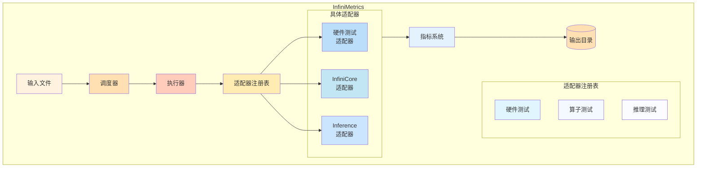

# 项目架构

本文档描述 InfiniMetrics 框架的架构和组织。

## 目录结构

```
InfiniMetrics/
├── main.py                          # 主入口文件
├── infinimetrics/
│   ├── adapter.py                  # 基础适配器接口
│   ├── dispatcher.py               # 测试编排调度器
│   ├── executor.py                 # 通用测试执行器
│   ├── input.py                    # 测试输入数据类
│   │
│   ├── common/                     # 共享工具
│   │   ├── constants.py            # 测试类型、指标、枚举
│   │   ├── metrics.py              # 指标定义
│   │   └── testcase_utils.py      # 测试用例工具
│   │
│   ├── hardware/                   # 硬件测试模块
│   │   └── cuda-memory-benchmark/  # CUDA 内存基准测试套件
│   │       ├── include/            # C++ 头文件
│   │       ├── src/                # CUDA/C++ 源代码
│   │       ├── CMakeLists.txt     # 构建配置
│   │       ├── build.sh            # 构建脚本
│   │       └── QUICKSTART.md       # 硬件测试快速开始指南
│   │
│   ├── operators/                  # 算子级测试
│   │   ├── infinicore_adapter.py   # InfiniCore 操作
│   │   └── flops_calculator.py    # FLOPS 计算器
│   │
│   ├── inference/                  # 推理评估
│   │   ├── adapters/
│   │   │   ├── infinilm_adapter.py # InfiniLM 适配器
│   │   │   └── vllm_adapter.py     # vLLM 适配器
│   │   ├── infer_main.py           # 推理入口点
│   │   └── utils/                  # 推理工具
│   │
│   ├── communication/              # 通信测试
│   │   └── nccl_adapter.py         # NCCL 适配器
│   │
│   └── utils/                      # 工具函数
│       └── input_loader.py        # 输入文件加载器
│       └── ...
|
├── submodules/
│   └── nccl-tests/                 # NCCL 测试套件（git 子模块）
│
├── format_input_comprehensive_hardware.json  # 示例配置
└── summary_output/                # 测试结果目录
```

## 架构图



## 组件概述

### 主入口
- **main.py**: 从命令行运行测试的入口点

### 核心组件
- **adapter.py**: 所有测试适配器必须实现的基础适配器接口
- **dispatcher.py**: 编排测试执行并管理适配器注册表
- **executor.py**: 通过适配器运行测试的通用测试执行器

### 测试类别
- **hardware/**: 硬件级基准测试（内存、缓存、计算）
- **operators/**: 算子级性能测试
- **inference/**: 端到端推理评估
- **communication/**: 加速卡通信测试

### 公共工具
- **common/constants.py**: 测试类型、指标和枚举
- **common/metrics.py**: 指标定义和数据结构
- **common/testcase_utils.py**: 测试用例解析和验证

## 数据流

1. **输入**: JSON 配置文件指定测试参数
2. **调度**: 调度器解析输入并选择适当的适配器
3. **执行**: 执行器通过适配器运行测试
4. **收集**: 指标被收集和聚合
5. **输出**: 结果保存到输出目录

有关配置的更多详情，请参阅[配置指南](./configuration.md)。
