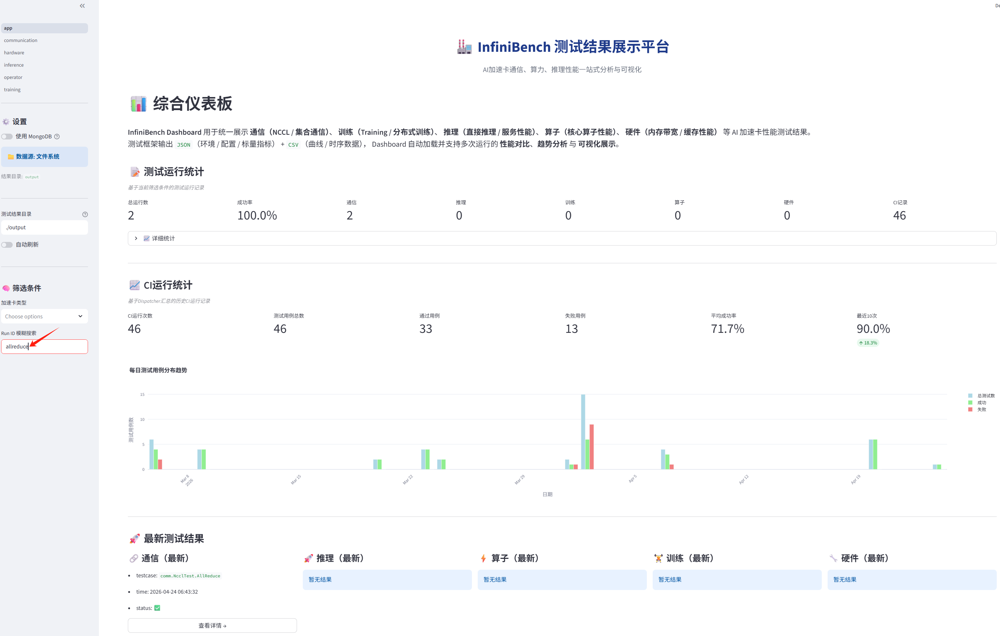
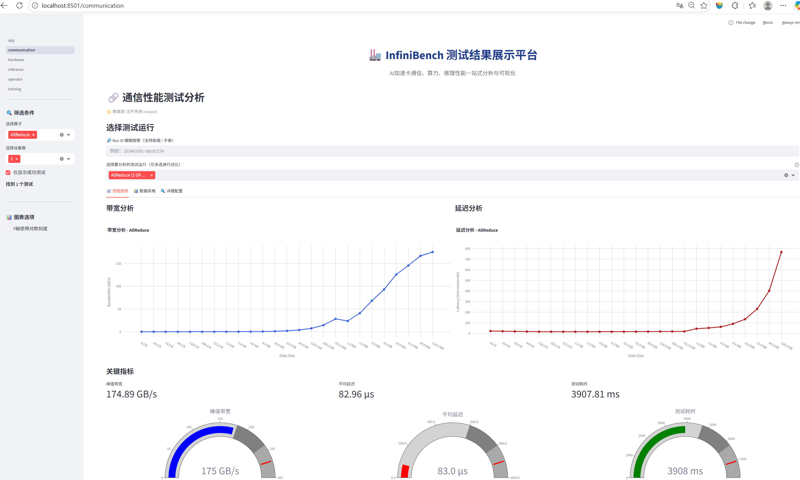
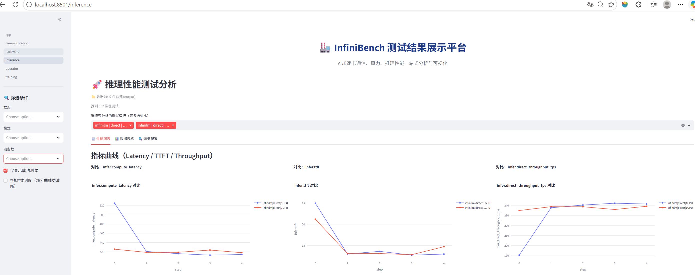
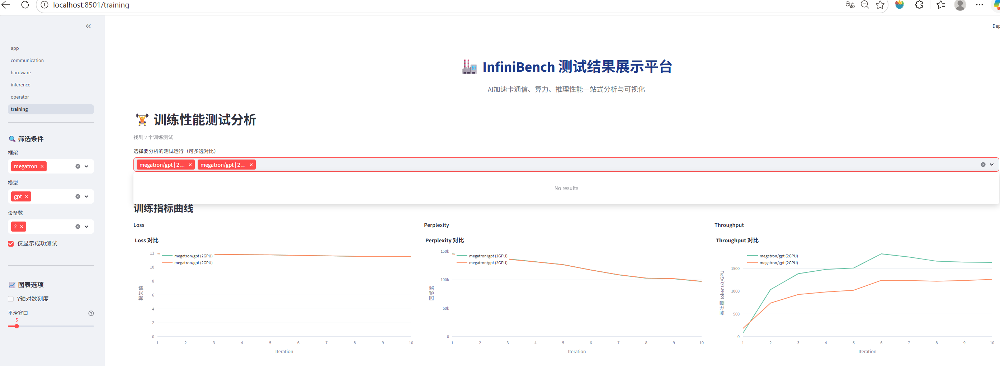
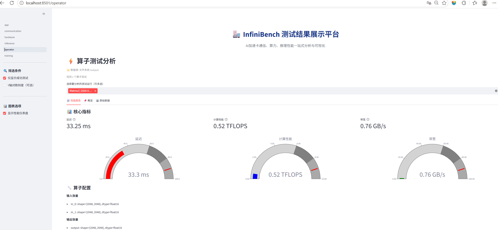

# InfiniBench Dashboard 使用指南

## 1. Dashboard 简介

InfiniBench Dashboard 用于统一展示 AI 加速卡在以下场景下的测试与评测结果

- 通信（NCCL / 集合通信）
- 训练（Training / 分布式训练）
- 推理（Direct / Service 推理）
- 算子（核心算子性能）

测试框架输出两类数据：
```
JSON  -> 配置 / 环境 / 标量指标
CSV   -> 曲线 / 时序数据
```
Dashboard 会自动加载测试结果，并提供统一的分析功能，包括：

- Run ID 模糊搜索：支持通过部分 Run ID 快速定位测试运行

- 通用筛选器：按框架、模型、设备数量等条件筛选

- 多运行对比：同时选择多个测试运行进行性能对比

- 性能可视化：展示 latency / throughput / loss 等性能曲线

- 统计与配置展示：查看吞吐量统计、运行配置和环境信息

例如可以输入：
```
allreduce
service
```
对 Run ID 进行模糊匹配搜索

示例截图：


## 2. 运行 Dashboard 
### 2.1 环境依赖
使用 Dashboard 前需要安装以下依赖：
```
streamlit
plotly
pandas
```
### 2.2 启动 Dashboard
在项目根目录执行：
```
python -m streamlit run dashboard/app.py
```
访问地址，启动成功后显示：
```
Local URL:    http://localhost:8501
Network URL:  http://<server-ip>:8501
```
说明：

Local URL：仅本机访问

Network URL：同一网络内其他机器可访问

## 3. 通信测试分析
路径：

```
Dashboard → 通信性能测试
```

支持：
```
带宽分析曲线 - 峰值带宽

延迟分析曲线 - 平均延迟

测试耗时

显存使用

通信配置解析
```

示例截图：


## 4. 推理测试分析

路径：

```
Dashboard → 推理性能测试
```

模式：
```
Direct Inference
Service Inference
```
展示指标：
```
TTFT

Latency

Throughput

显存使用

推理配置解析
```
示例截图：



## 5. 训练测试分析
路径：

```
Dashboard → 训练性能测试
```

支持：
```
Loss 曲线

Perplexity 曲线

Throughput 曲线

显存使用

训练配置解析
```
示例截图：



## 6. 算子测试分析

路径：

```
Dashboard → 算子性能测试
```

支持：
```
latency

flops

bandwidth
```

示例截图：


